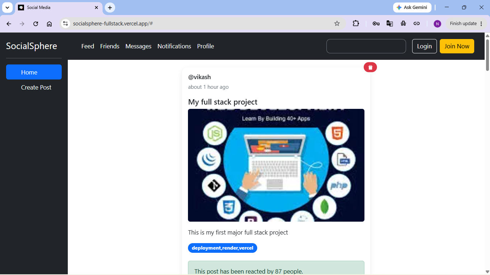
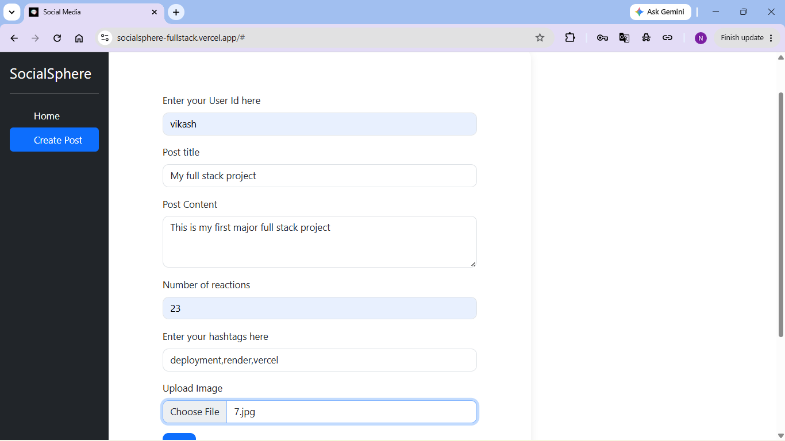

# 🌐 SocialSphere Full Stack

A full-stack social media web application where users can create posts, upload images, view community posts, and delete posts in real time.

## 🚀 Live Demo

**Frontend:** https://socialsphere-fullstack.vercel.app/

**Backend API:** https://socialsphere-backend-bqqz.onrender.com/posts

## ✨ Features

* Create new posts
* Upload images using ImageKit Cloud Storage
* View all posts from MongoDB
* Delete posts
* User ID and timestamp display
* Responsive Bootstrap UI
* Real-time updates using React Context API

## 🛠️ Tech Stack

### Frontend

* React
* Vite
* Bootstrap
* Axios
* Context API
* React Icons

### Backend

* Node.js
* Express.js
* MongoDB Atlas
* Mongoose
* Multer

### Cloud Services

* ImageKit (Image Storage)
* Render (Backend Hosting)
* Vercel (Frontend Hosting)

## 📸 Screenshots

### Feed Page



### Create Post Page



## 📂 Project Structure

```text
socialsphere-fullstack
├── backend
│   ├── models
│   ├── routes
│   └── server.js
│
├── public
├── src
│   ├── components
│   ├── store
│   └── assets
│
├── screenshots
│   ├── feed.png
│   └── create-post.png
│
└── package.json
```

## ▶️ Run Locally

### Frontend

```bash
npm install
npm run dev
```

### Backend

```bash
cd backend
npm install
npm start
```

## 📚 Key Learnings

* Building a full-stack React application
* Creating REST APIs with Express
* MongoDB integration using Mongoose
* Image uploads with Multer
* Cloud image hosting with ImageKit
* State management using Context API and useReducer
* Deploying applications using Render and Vercel
* Working with real-world CRUD operations

## 🔗 GitHub Repository

https://github.com/vikash-kherwa/socialsphere-fullstack

---

Made by **Vikash Kherwa**
